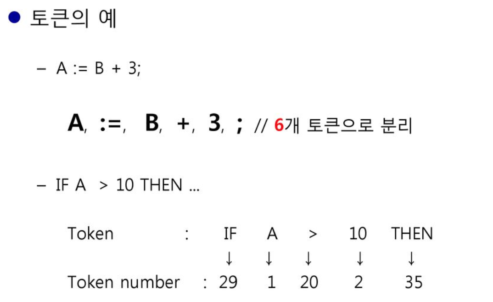
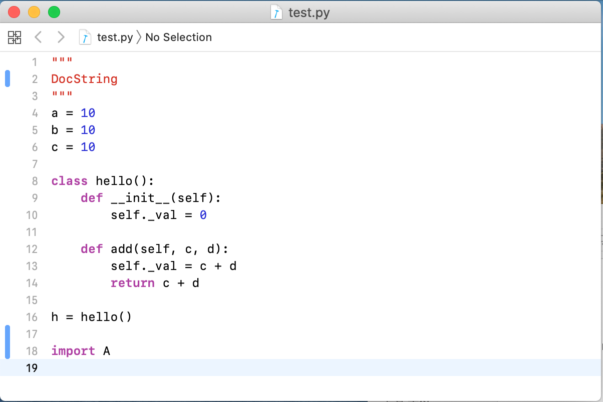
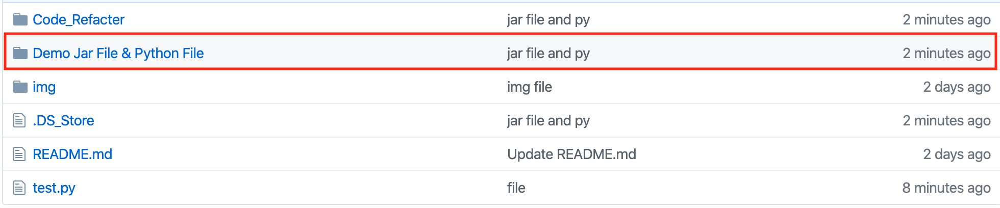
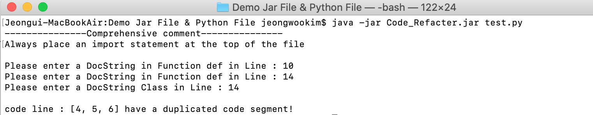

# Refactoring-Automation-Tool
자바기반의 파이썬 리펙토링 도구                                

## 소프트웨어 소개:  
자바 기반의 파이썬 분석 도구를 개발합니다. 
분석 언어는 파이썬이며 파서생성기(Antlr)를 사용해 AST를 구축하며, 최종 기능으로 코드 리펙토링을 위한 솔루션을 제공합니다. 
비슷한 오픈소스로는 Pylint가 있습니다.참고서적은 브렛 슬라킷의 이펙티브 파이썬이며 언어의 스타일에 맞는 리펙토링 가이드를 제공하려고 합니다. 
코드 스멜은 <a>https://sourcemaking.com/</a>을 참고했으며, 이를 발견하면 프로그램은 Console를 통해 보여줍니다.

-	환경 구성 단계 
파이썬 AST를 프로그램내에서 만들 수 있어야 합니다. 이를 위해서 파서생성기 Antlr를 intelliJ와 연동하고 GitHub에서 
파이썬 G4파일을 clone받아 파서생성기를 구축합니다. 

## Antlr란?
 
컴퓨터 기반 언어 인식에서 ANTLR(Another Tool For Language Recognition)는 구문 분석을 위해 LL(*)을 사용하는 파서 발생기.
IDE와 연동을 통해서 프로그래밍언어에 대한 처리를 가능하게 함 
Github : https://github.com/antlr/antlr4/blob/master/doc/index.md

### *리펙토링 기능* 

#### 1. Import구문 위치 확인 
파이썬은 모듈화를 위해서 import구문을 지원합니다. 코드의 가독성을 위해서 import문은 파일 상단에 위치하는 것이 좋습니다. Import문을 분석해서 만들어지는 AST의 구조입니다. 최상위 노드에서 자식노드를 반복문으로 확인해서 import 구문이 있는지 확인합니다. Flag변수를 선언해서 import문이 파일 중간에 위치할 때 ERROR메세지를 출력합니다. 

#### 2. For 와 while 루프 뒤에서는 else문 확인 
파이썬에서는 For문과 while문 뒤에 else블록이 오는 특수한 문법이 있습니다. 가독성을 떨어뜨리고 직관적이며 혼동하기 쉬우니 사용하지 않는 것이 좋습니다.
분기문 for, while 노드에 진입할 때 함수호출을 통해서 자식 노드의 개수를 확인하고 else블록이 있으면 ERROR메세지를 출력합니다. 

#### 3. Line 번호를 출력 
ERROR가 발생한 지점의 라인번호를 출력합니다. 전역변수를 통해서 라인번호를 저장합니다. 라인번호를 출력하고 ERROR메세지를 출력합니다.
  
#### 4. Duplicated Source Code 
같은 패턴으로 구현된 코드조각을 찾습니다. 같은 패턴으로 구현된 코드에 대해서 라인번호와 오류메세지를 출력합니다.  
- 구현 방법 -  
파서생성기에서는 토큰을 위와 같이 타입 번호와 함께 저장합니다. 구현된 코드의 터미널 노드에서 token number를 수집해서 문자열 패턴을 만듭니다. 

({ LineNumber : 29120235 }를 HashMap에 저장)

패턴화된 문자열을 해쉬 맵에 저장시킵니다. 중복되는코드의 라인 번호와 함께 저장됩니다.해쉬맵에 저장되어 있는 값을 읽어 코드가 중복된 횟수를 기록합니다.

#### 5. 파이썬 파일의 문서화 – DocString 
파이썬은 협업을 위해서 모듈, 클래스, 함수에 주석을 작성해야 합니다. 프로그램을 이를 확인하고 추가하라는 메세지를 출력합니다. 

#### 6. 많은 매개변수  
함수 인자는 너무 많아지면 소스코드의 가독성과 사용성을 떨어뜨립니다. 

### How To Use  

위와 같이 test.py를 작성 합니다. 

folder의 jar파일이 저장된 경로에 들어갑니다.

jar file 실행 명령어를 통해서 실행하면 아래와 같은 결과를 출력할 수 있습니다. 

### 활용성  

### 발전 가능성  
